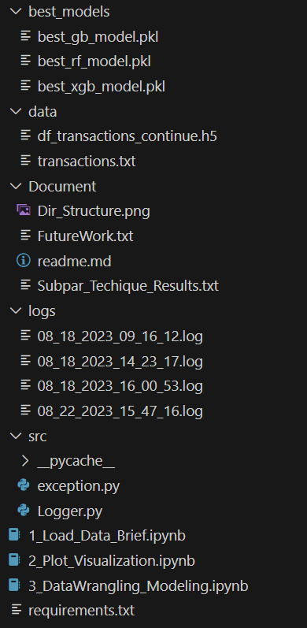

# Credit Card Fraud Detection Project

This project aims to detect credit card fraud using data analysis and machine learning techniques. It includes three main stages: loading and understanding the data, visualization and analysis, and data wrangling and modeling.

# Problem Statement
Part 1: Load & Understanding Data
Programmatically download and load into your favorite analytical tool the transactions data. This data, which is in line-delimited JSON format, can be found here. Please describe the structure of the data. Number of records and fields in each record? Please provide some additional basic summary statistics for each field. Be sure to include a count of null, minimum, maximum, and unique values where appropriate.

Part 2: Visualization and Analysis
Plot a histogram of the processed amounts of each transaction, the transactionAmount column. Report any structure you find and any hypotheses you have about that structure. More Analysis as per need.

Part 3: Data Wrangling - Duplicate Transactions, Multi-swipe Transactions
You will notice a number of what look like duplicated transactions in the data set. One type of duplicated transaction is a reversed transaction, where a purchase is followed by a reversal. Another example is a multi-swipe, where a vendor accidentally charges a customer's card multiple times within a short time span. Can you programmatically identify reversed and multi-swipe transactions? What total number of transactions and total dollar amount do you estimate for the reversed transactions? For the multi-swipe transactions? Please consider the first transaction to be "normal" and exclude it from the number of transaction and dollar amount counts. Did you find anything interesting about either kind of transaction?

Part 4: Modeling
Fraud is a problem for any bank. Fraud can take many forms, whether it is someone stealing a single credit card, to large batches of stolen credit card numbers being used on the web, or even a mass compromise of credit card numbers stolen from a merchant via tools like credit card skimming devices. Each of the transactions in the dataset has a field called isFraud. Please build a predictive model to determine whether a given transaction will be fraudulent or not. Use as much of the data as you like (or all of it). Provide an estimate of performance using an appropriate sample, and show your work. Please explain your methodology (modeling algorithm/method used and why, what features/data you found useful, what questions you have, and what you would do next with more time).

## Project Structure

## Contents

- `1_Load_Data_Brief.ipynb`: Jupyter Notebook for loading and understanding the dataset.
- `2_Plot_Visualization.ipynb`: Jupyter Notebook for data visualization and plotting.
- `3_DataWrangling_Modeling.ipynb`: Jupyter Notebook for data wrangling, EDA, data preparation, and building machine learning models.

- Notebook 1: 1_Load_Data_Brief.ipynb
In this initial notebook, I focused on establishing a strong foundation for the project. I meticulously loaded the dataset from github file and extracted the zip file in data folder, ensuring its integrity and consistency. This step was crucial to ensure that subsequent analyses and modeling were built upon reliable data. Afterwards, I worked on basic data exploration of Categorical, Numerical, and Datetime attributes and data structure.

- Notebook 2: 2_Plot_Visualization.ipynb
With a solid foundation in place, I delved into the world of data visualization. This notebook was dedicated to unraveling the hidden patterns within the dataset. Through an array of plots, charts, and visualizations, I deciphered the distribution of features, uncovered potential correlations, and gained crucial insights into the underlying trends. These visual revelations served as guiding lights for subsequent decision-making.

- Notebook 3: 3_DataWrangling_Modeling.ipynb
In the final phase of my exploration, I undertook comprehensive data wrangling and modeling endeavors. This notebook encapsulated the essence of my project, combining the insights from previous notebooks into actionable steps. Here, I embarked on an intricate journey: 
    - Duplicate Transaction Identification: I delved into the identification and analysis of multi-swipe and reversed duplicate transactions. This endeavor provided a deeper understanding of these transactions' impact on the overall dataset. 
    - Feature Engineering, Cleaning, and Normalization: With an eye for improvement, I engaged in feature engineering to harness the latent potential of the dataset. Additionally, I handled missing values and employed normalization techniques to ensure data consistency and reliability.
    - Effective Imbalanced Data Handling: Recognizing the importance of tackling data imbalance, I implemented an undersampling strategy with n iterations. This method effectively addressed the challenge while retaining the integrity of the dataset.
    - Advanced Modeling with Rigorous Evaluation: Armed with well-preprocessed data, I ventured into modeling armed with cross-validation and hyperparameter tuning. Rigorous evaluation using key metrics helped ascertain the model's performance and suitability for the fraud detection task.

### Source Code

- `src/exception.py`: Python module for handling exceptions.
- `src/Logger.py`: Python module for logging.

### Logs

- `logs/`: Directory to store log files generated during the project.

### Data

- `data/modified_dataset.h5`: Modified dataset in HDF5 format.

### Best Models

- `best_models/`: Directory to store the best-performing machine learning models under n iterations of undersampling saved in .pkl format.

## How to Run

1. Install the required packages by running the following command in the terminal:
   
- pip install -r requirements.txt

2. The recommended order of execution for the Jupyter Notebook files is as follows:
- `1_Load_Data_Brief.ipynb`
- `2_Plot_Visualization.ipynb`
- `3_DataWrangling_Modeling.ipynb`

I have highlighted all the steps involved in these notebook(.ipynb) files. 
